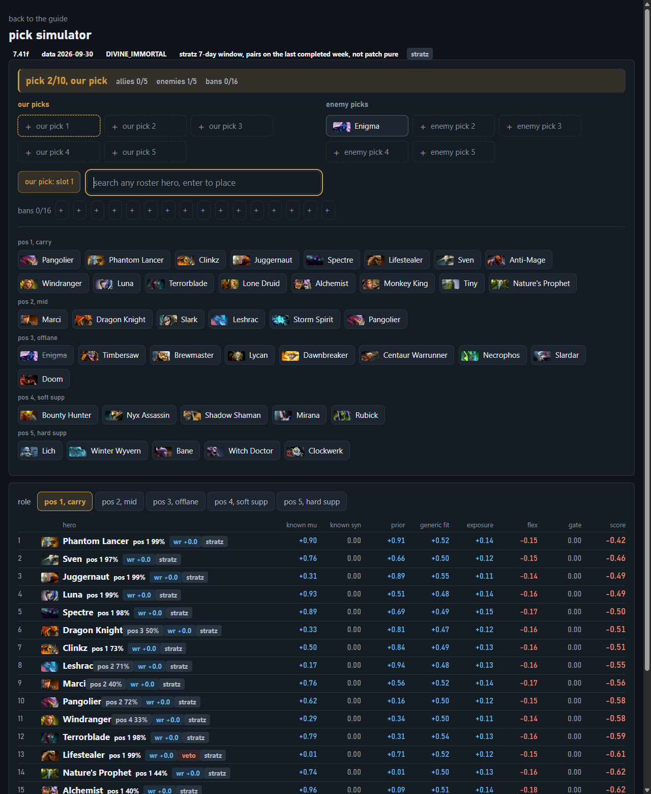
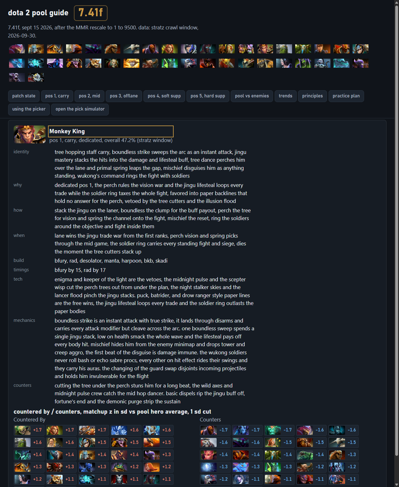
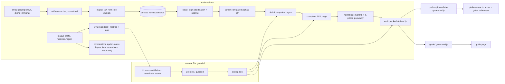
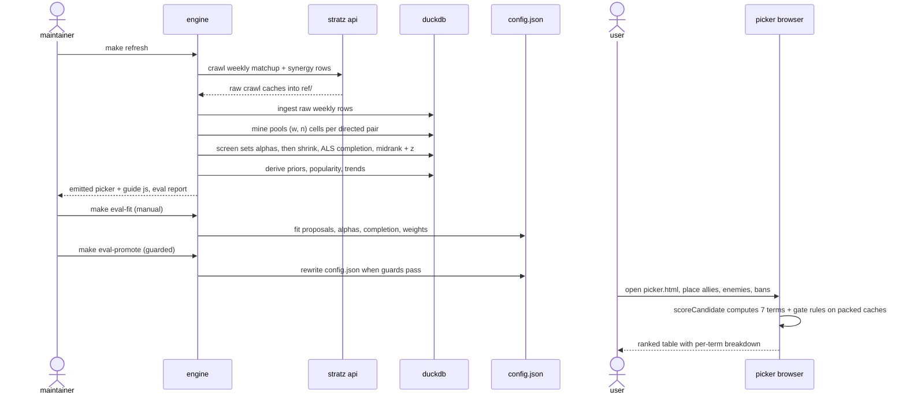

# dota helper

offline dota 2 pick simulator and hero-pool guide for patch 7.41f. static pages with zero runtime deps, an offline go engine over duckdb, and one authored config hub. the picker is the main tool, the guide supplements it.

## tools

- `picker/`: draft board with direct slot aiming, ban strip, and per-term scored ranking for the selected role
- `guide/`: patch state, hero panels, heatmap, trends, principles, practice
- `ui/ui.css`: shared dark-hud token sheet, single source for every color, type, spacing, and control-size value. both pages link it as `../ui/ui.css`, page css adds layout only

## layout

- `config.json` + `content.json`: the authored config hub (pool, roles, scope, scoring constants, paths) and authored prose, single source of truth
- `engine/`: go offline engine (fetch, ingest, mine, emit, eval) over duckdb, module `poolguide`
- `scripts/`: powershell orchestration, the matchups and howdoiplay crawls, the guide data build, and the check guard
- `ref/`: committed stratz crawl caches, matchup tables, and eval reports, the rebuildable raw layer
- `playground/`: one-off utilities
- `var/`: gitignored live state, the duckdb database, engine binary, eval fits, and the stratz token

## data flow

STRATZ graphql crawl (divine-immortal, ranked all pick) into `ref/dota2/synergy/raw/` caches, per-match draft backfill (league captains-mode drafts with true pick/ban order) into `ref/dota2/matches/raw/matches.ndjson`, duckdb under `var/`, shrinkage + normalization + ALS completion + expectimax-lite scoring in the engine, emitted as generated js the static pages import. the techniques section below unpacks that chain stage by stage.

## techniques

every number the picker shows is mined offline from the committed raw layer, the browser only runs a linear score plus authored gate rules over precomputed cells. the architecture graph shows where each stage runs, the sequence diagram walks the refresh and draft-scoring flows, and the inventory table lists each technique with where it lives and why the data forces it.

### architecture

### sequence

### inventory

| stage | technique | where | why |
| --- | --- | --- | --- |
| clean | source sign adjudication + match-weighted pooling | `engine/internal/mine/cell.go` | crawl rows arrive with flipped sign conventions and weekly duplicates, pooling folds them into one canonical (wins, n) per directed pair before any estimator runs |
| shrink | empirical-bayes shrinkage, beta-form pseudo-counts, posterior variance per cell, source confidence tiers | `engine/internal/analytics/shrink.go`, `engine/internal/mine/cell.go` | weekly pair samples run thin, (w + alpha\*p0)/(n + alpha) pulls small-n cells toward the fair-rate neutral instead of letting noise through, each cell also carries a posterior variance and a source-confidence label |
| shrink | moment-matched alpha fit, variance decomposition | `engine/internal/eval/fitalpha.go` | alpha = sigma^2/tau^2 estimated from binomial noise against observed delta variance, so prior strength comes from the data rather than taste |
| screen | BH-gated significance screen with alpha inflation | `engine/internal/mine/screen.go`, `engine/internal/stats/multiple.go` | cells statistically indistinguishable from the hero baseline shrink harder, an a/b measured no gain so it ships disabled |
| complete | ridge-regularized ALS matrix completion + masked-cell cross-validation | `engine/internal/analytics/complete.go`, `engine/internal/mine/norm.go`, `engine/internal/eval/fitcompletion.go` | the pool x 127 matchup and synergy matrices have uncrawled and thin cells, low-rank factorization refills them from structure, rank and lambda picked by held-out spearman |
| normalize | midrank percentiles + z-score standardization, priors, pick-share popularity | `engine/internal/analytics/normalize.go`, `engine/internal/analytics/prior.go`, `engine/internal/mine/overall.go` | raw pp deltas are incomparable across heroes with different coverage, row-wise ranks make one weight vector serve all heroes, pick shares drive the expectation over unseen picks |
| score | expectimax-lite 7-term linear draft scorer | `engine/internal/analytics/score.go`, `picker/picker-score.js` | at pick time most of the draft is unseen, genericFit and exposure take popularity-weighted expectations over unseen allies and enemies while flexibility penalizes matchup dispersion over the most popular unseen enemies, the js twin keeps browser and engine bit-identical |
| gates | rule-based gating layer | `engine/internal/gates/gates.go`, `picker/gates.json` | authored hard gates, penalties, and bonuses layer knowledge on top of the statistical score |
| fit | coordinate-ascent grid search + ablation + guarded promotion | `engine/internal/eval/fit.go`, `engine/internal/eval/promote.go` | scoring weights hill-climb train mean pick percentile, gains measured on a time-ordered holdout, promotions must clear bootstrap intervals before config.json changes |
| backtest | order-aware sequential replay | `engine/internal/eval/replay.go` | replays league drafts pick by pick using only previously visible info, so no lookahead leaks into the metrics |
| metrics | ROC AUC as mann-whitney u, mean percentile, top-k hit rate, decile calibration | `engine/internal/stats/auc.go`, `engine/internal/eval/metrics.go` | audits the scorer in the role it is used, as a ranker, plus calibration bins on the holdout |
| stats | chi-square 2x2, exact binomial, holm + benjamini-hochberg | `engine/internal/stats/chisq.go`, `engine/internal/stats/binomial.go`, `engine/internal/stats/multiple.go` | significance testing with FWER and FDR control for the screen and the raw-count audit |
| stats | percentile bootstrap intervals, match-level resampling, spearman rank correlation | `engine/internal/stats/bootstrap.go`, `engine/internal/stats/rankcorr.go`, `engine/internal/eval/metrics.go` | reported deltas carry resampled intervals that keep picks grouped, spearman cross-checks normalized output against raw lift |
| comparator | vertical-bitmap apriori over side-composition triples, support, confidence, lift, conviction | `engine/internal/eval/triples.go` | levelwise frequent-set mining benchmarks the pairwise model, report-only, never feeds the live score |
| comparator | bernoulli naive bayes with laplace smoothing, cosine knn over one-hot drafts, bagged AUC-fitted blend | `engine/internal/eval/naivebayes.go`, `engine/internal/eval/knn.go`, `engine/internal/eval/ensemble.go` | classifier baselines on final drafts contextualize the linear scorer, report-only, never feeds the live score |
| comparator | pick-order transition stats, laplace-smoothed, direction census | `engine/internal/eval/seq.go` | sequential pattern view of draft-order asymmetry, report-only, never feeds the live score |
| builds | frequency aggregation, weighted first moment, recipe suppression | `engine/internal/builds/builds.go` | item builds come from per-match purchase counts with component-vs-upgrade dedup |
| trends | latest-pair snapshot differencing | `engine/internal/mine/trend.go` | wr and pick-share deltas between the two most recent snapshot dates |

## data policy

- STRATZ is always the primary source, the raw data the product uses is exclusively STRATZ. the API runs at 7 requests/second with the token at `var/stratz.token` (or `STRATZ_TOKEN` env), the token never goes into a tracked file, `make check` enforces it
- the dotabuff fallback tier retired from scoring on 2026-09-29, its dumps stay on disk locally as frozen reference and are not part of this repo, ingest actively purges their rows
- OpenDota is manual fallback tooling only, it never enters scoring
- per-match pub data is token-gated on the default STRATZ tier, so the draft backfill runs over league matches which carry full pick/ban drafts

## engine

the go engine runs only inside the golang:1.27 linux image (the duckdb cgo driver has no supported windows toolchain). every build, test, and invocation goes through make targets wrapping docker, never go on the host. named volumes `poolguide-mod` and `poolguide-build` keep the module and build caches warm.

## make targets

`make refresh` is the unified pipeline command (serial only, never -j). the others by group:

- view: `serve` (http server for browser tooling, file:// is blocked there), `picker`, `dota`
- fetch: `fetch-stratz`, `fetch-builds`, `fetch-matches`, `fetch-positions`, `fetch-howdoiplay`, `fetch-matchups`, plus `-refresh` variants
- build data: `ingest`, `mine`, `emit` (or `emit-data`, `emit-guide`, `emit-picker`), `emit-goldens`, `build-guide-data`, `sync-builds`, `merge-mechanics`, `fixtures`, `order-pool`
- evaluate: `eval`, `eval-fit`, `eval-fit-alphas`, `eval-fit-completion`, `eval-promote SECTION=weights|alphas|completion`
- test: `test`, `test-picker`, `test-picker-cover`, `engine-test`, `engine-test-<pkg>`, `engine-cover`, `engine-cover-summary`, `engine-cover-<pkg>`, `coverage-badge`, `check`, `check-linux`, `verify`
- inspect: `db-query Q=...`, `probe-*`

## conventions

- generated files (`picker-data-generated.js`, `guide-data-generated.js`, `data.js`) are engine output, never edited by hand. after an intentional config change run `make ingest mine emit`, then `make emit-goldens`
- pool counts, roster counts, and hero lists are always derived from `config.json` or the roster table, never hardcoded
- hero prose is general first principles, no numerics in descriptions, matchup winrates live only in the generated tables, `make check` enforces the prose rules
- tier is a board label only, it never enters scoring, every hero scores from mined data under identical terms

## ci

two jobs on push to main: `check` (test-picker plus the static guard) and `coverage` (the dockerized engine suite with `make engine-cover` plus the node coverage run). the coverage job fails below the project floor of 90 and commits `coverage.json`, the shields endpoint the readme badge renders. the full suite takes 30-60m locally via `make engine-test`, `make check-linux` replays the static guard under linux pwsh the way ci runs it.

## license

mit
